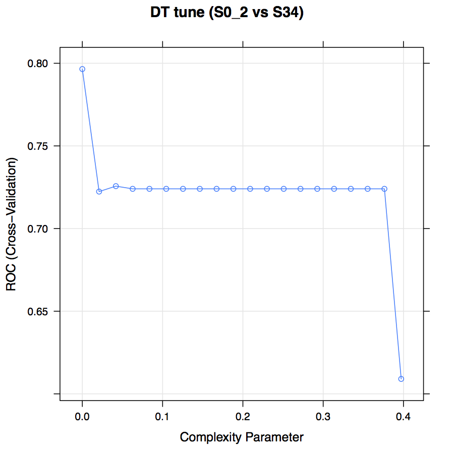
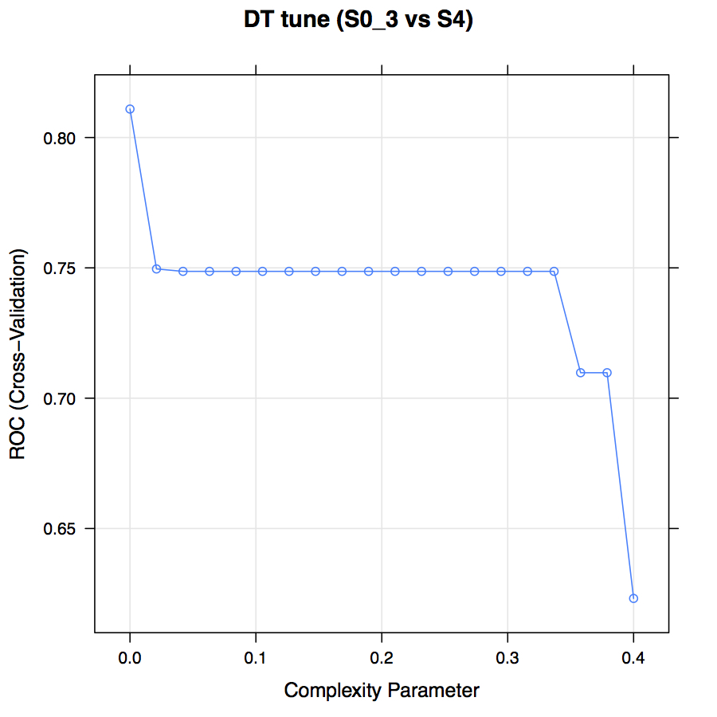
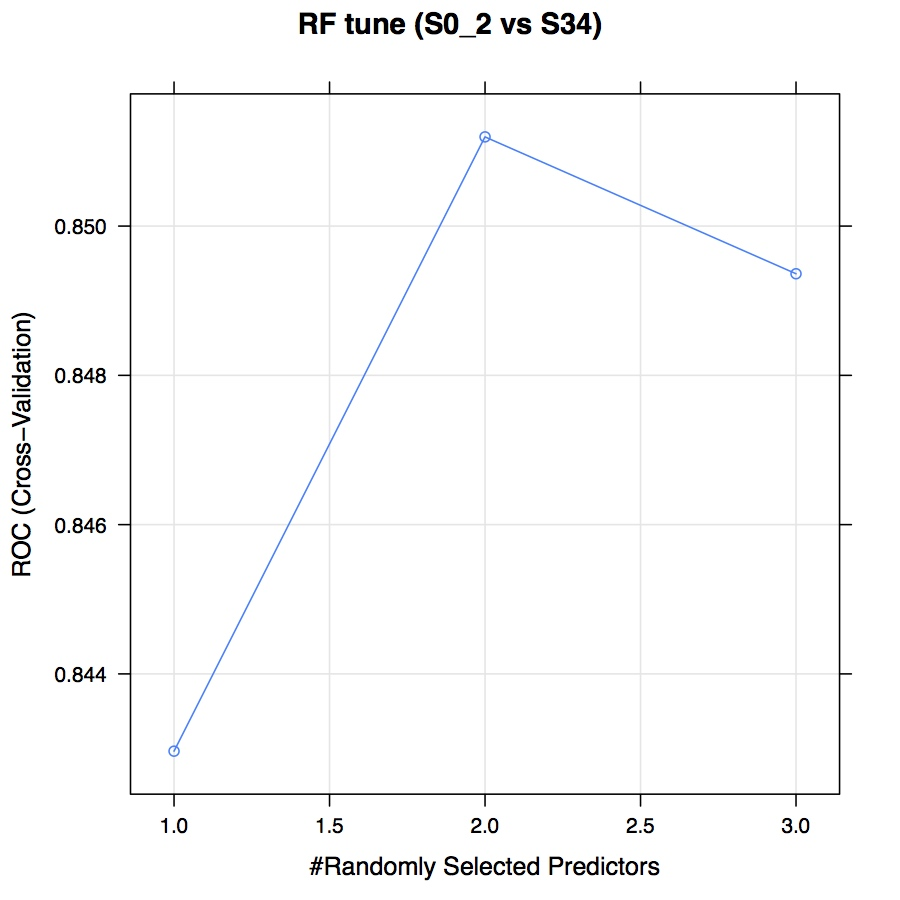
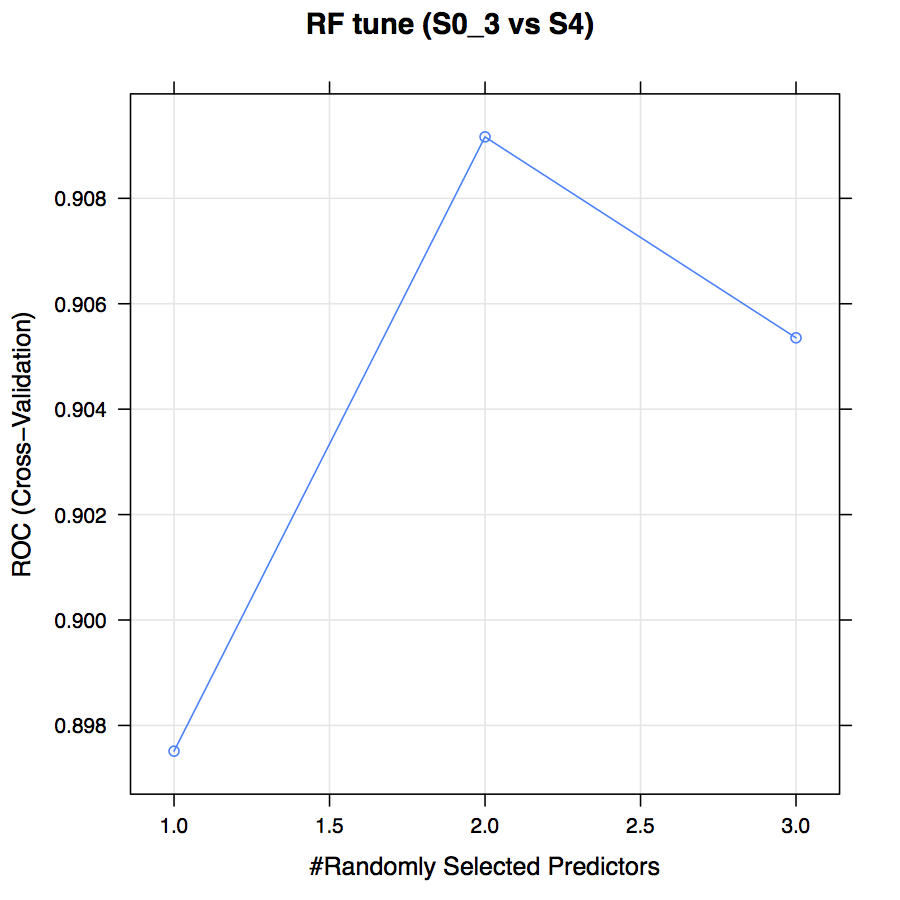
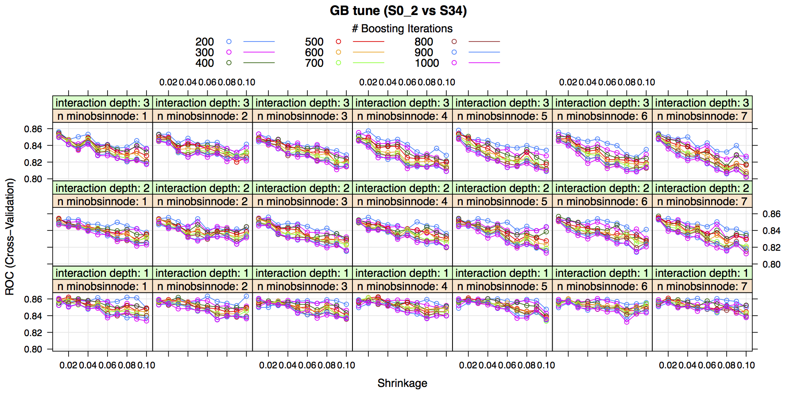
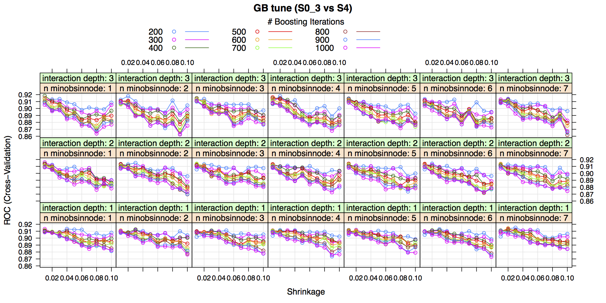

\pagebreak
# Session Info
```{r, message=FALSE, warning=FALSE, include=FALSE}
require(ggplot2)
require(dplyr)
require(magrittr)
require(rpart)
require(randomForest)
require(gbm)
require(pROC)
require(PRROC)
require(knitr)
require(reshape2)
require(ggsignif)
require(RColorBrewer)

color_set <- c("#377EB8", "#4DAF4A", "#984EA3", "#E41A1C", "#FF7F00")
HCV_pre <- read.csv("HCV_pre.csv", row.names = 1)
HCV_pre_text <- read.csv("HCV_pre_text.csv", row.names = 1)

session_Info_ori <- sessionInfo()
session_Info <- session_Info_ori$otherPkgs
n <- length(session_Info)
pkg_tb <- matrix(NA, n, 2) %>% data.frame()
colnames(pkg_tb) <- c("Package", "Version")

for (i in 1:n){
  pkg_tb$Package[i]<-c(session_Info[[i]]["Package"])
  pkg_tb$Version[i]<-c(session_Info[[i]]["Version"])
 }
```

```{r, echo=FALSE, message=FALSE, warning=FALSE}
session_Info_ori$R.version$version.string %>% print()
paste0("Platform: ",session_Info_ori$R.version$platform) %>% print()
paste0("Running under: ",session_Info_ori$running) %>% print()
kable(pkg_tb)
```

# Datasets
```{r, message=FALSE, warning=FALSE, include=FALSE}
setwd("~/Google Drive/Rum Wei/LF_FIB4_split/Data_Clean_Apr_23")
```

```{r, echo=TRUE, message=FALSE, warning=FALSE}
discovery_df <- read.csv("discovery_set.csv")
validation_df1 <- read.csv("validation_set1.csv")
validation_df2 <- read.csv("validation_set2.csv")
validation_df3 <- read.csv("validation_set3.csv")
```

# Hyper-parameter Settings

## DT

We tuned the _complexity_ for DT.





## RF

We tuned the _mtry_ parameter for RF.




## GB

We tuned the _interaction.depth_, _n.trees_, _shrinkage_ and _n.minobsinnode_ for GB.




# Model Selection

## S0_2 vs S34
```{r, message=FALSE, warning=FALSE, echo=T, results='hide'}
auc_df_comp_1 <- data.frame(Curve=character(), Method=character(), 
                            AUC=numeric(), Idx=numeric())

discovery_df$Y <- (discovery_df$group_1 %>% as.factor %>% as.numeric)-1
for(i in 1:100) {
  smp_idx <- sample(1:nrow(discovery_df), floor(nrow(discovery_df)*.7))
  
  train_temp <- discovery_df[smp_idx, ]
  test_temp <- discovery_df[-smp_idx, ]
  
  model_0 <- glm(Y ~ FIB4, data=train_temp, na.action=na.roughfix, family=binomial)
  model_1 <- rpart(factor(Y) ~ AST+ALT+PLT+Age, data=train_temp, cp = 0)
  model_2 <- randomForest(factor(Y) ~ AST+ALT+PLT+Age, ntree=500, mtry=2,
                          na.action=na.roughfix, data=train_temp)
  model_3 <- gbm(Y ~ AST+ALT+PLT+Age, data=train_temp,
                 n.trees = 400, interaction.depth = 1, 
                 shrinkage = 0.03, n.minobsinnode = 4)
  
  pred_0 <- predict(model_0, test_temp)
  pred_1 <- predict(model_1, test_temp, type='prob')[, 2]
  pred_2 <- predict(model_2, test_temp, type='prob')[, 2]
  pred_3 <- predict(model_3, test_temp, n.trees=400, type='link')
  
  for(j in 0:3) {
    roc_temp <- eval(parse(text=paste0('roc(test_temp$Y, pred_', j, ')')))
    pr_temp <- eval(parse(text=paste0("pr.curve(pred_", j, "[test_temp$Y==1] %>% na.omit, ", 
                                      'pred_', j, "[test_temp$Y==0] %>% na.omit)")))
    auc_df_comp_1 <- rbind(auc_df_comp_1, 
                           data.frame(Curve=c('AUROC', 'AUPR'), Method=paste0('pred_', j), 
                                      AUC=c(roc_temp$auc, pr_temp$auc.integral), Idx=i))
  }
}

method_vec <- c('FIB-4', 'DT', 'RF', 'GB')
names(method_vec) <- unique(auc_df_comp_1$Method)
auc_df_comp_1$Class <- 'S0_2 vs S34'
```

## S0_3 vs S4
```{r, message=FALSE, warning=FALSE, echo=T, results='hide'}
auc_df_comp_2 <- data.frame(Curve=character(), Method=character(), 
                            AUC=numeric(), Idx=numeric())

discovery_df$Y <- (discovery_df$group_2 %>% as.factor %>% as.numeric)-1
for(i in 1:100) {
  smp_idx <- sample(1:nrow(discovery_df), floor(nrow(discovery_df)*.7))
  
  train_temp <- discovery_df[smp_idx, ]
  test_temp <- discovery_df[-smp_idx, ]
  
  model_0 <- glm(Y ~ FIB4, data=train_temp, na.action=na.roughfix, family=binomial)
  model_1 <- rpart(factor(Y) ~ AST+ALT+PLT+Age, data=train_temp, cp = 0)
  model_2 <- randomForest(factor(Y) ~ AST+ALT+PLT+Age, ntree=500, mtry=2,
                          na.action=na.roughfix, data=train_temp)
  model_3 <- gbm(Y ~ AST+ALT+PLT+Age, data=train_temp, 
                 n.trees = 400, interaction.depth = 3, 
                 shrinkage = 0.01, n.minobsinnode = 1)
  
  pred_0 <- predict(model_0, test_temp)
  pred_1 <- predict(model_1, test_temp, type='prob')[, 2]
  pred_2 <- predict(model_2, test_temp, type='prob')[, 2]
  pred_3 <- predict(model_3, test_temp, n.trees=400, type='link')
  
  for(j in 0:3) {
    roc_temp <- eval(parse(text=paste0('roc(test_temp$Y, pred_', j, ')')))
    pr_temp <- eval(parse(text=paste0("pr.curve(pred_", j, "[test_temp$Y==1] %>% na.omit, ", 
                                      'pred_', j, "[test_temp$Y==0] %>% na.omit)")))
    auc_df_comp_2 <- rbind(auc_df_comp_2, 
                           data.frame(Curve=c('AUROC', 'AUPR'), Method=paste0('pred_', j), 
                                      AUC=c(roc_temp$auc, pr_temp$auc.integral), Idx=i))
  }
}

method_vec <- c('FIB-4', 'DT', 'RF', 'GB')
names(method_vec) <- unique(auc_df_comp_2$Method)
auc_df_comp_2$Class <- 'S0_3 vs S4'
```

## Combination and Plotting
```{r, echo=TRUE, message=FALSE, warning=FALSE}
auc_df_comp_combine <- auc_df_comp_1 %>% bind_rows(auc_df_comp_2)

ggplot(auc_df_comp_combine, aes(x=Method, y=AUC)) + 
  geom_boxplot(aes(fill=Method)) + theme_bw() + 
  facet_grid(Curve~Class, scales = 'free') + 
  scale_x_discrete(labels=method_vec) + 
  scale_fill_manual(values=color_set) + 
  theme(legend.position = 'none', 
        axis.text.x = element_text(angle = 15, hjust = 1), 
        text = element_text(size=16))
```


# Model Construction and Validation in HBV Cohorts

## Final GB Models on Discovery Set
```{r, echo=TRUE, message=FALSE, warning=FALSE, results='hide'}
set.seed(12345)
GB_model_1 <- gbm(as.numeric(factor(group_1))-1 ~ Age+AST+ALT+PLT, 
                  data=discovery_df, n.trees = 400, interaction.depth = 1, 
                  shrinkage = 0.03, n.minobsinnode = 4)

set.seed(12345)
GB_model_2 <- gbm(as.numeric(factor(group_2))-1 ~ Age+AST+ALT+PLT, 
                  data=discovery_df, n.trees = 400, interaction.depth = 3, 
                  shrinkage = 0.01, n.minobsinnode = 1)
```

## ROC and PR of GB Models in Discovery Set
```{r, echo=TRUE, message=FALSE, warning=FALSE, results='hide'}
ROC_GB_train_1 <- roc(discovery_df$group_1, GB_model_1$fit)
ROC_GB_train_1_smth <- ROC_GB_train_1 %>% pROC::smooth(n=500)
GB_cut_train_1_cut <- coords(ROC_GB_train_1, 'best')

ROC_GB_train_2 <- roc(discovery_df$group_2, GB_model_2$fit)
ROC_GB_train_2_smth <- ROC_GB_train_2 %>% pROC::smooth(n=500)
GB_cut_train_2_cut <- coords(ROC_GB_train_2, 'best')

PR_GB_train_1 <- pr.curve(GB_model_1$fit[discovery_df$group_1=='S34'], 
                          GB_model_1$fit[discovery_df$group_1=='S0_2'], 
                          curve=T)

PR_GB_train_2 <- pr.curve(GB_model_2$fit[discovery_df$group_2=='S4'], 
                          GB_model_2$fit[discovery_df$group_2=='S0_3'], 
                          curve=T)
```

## ROC and PR of FIB-4 in Discovery Set
```{r, echo=TRUE, message=FALSE, warning=FALSE, results='hide'}
ROC_FIB4_train_1 <- roc(discovery_df$group_1, discovery_df$FIB4)
ROC_FIB4_train_1_smth <- ROC_FIB4_train_1 %>% pROC::smooth(n=500)

ROC_FIB4_train_2 <- roc(discovery_df$group_2, discovery_df$FIB4)
ROC_FIB4_train_2_smth <- ROC_FIB4_train_2 %>% pROC::smooth(n=500)

PR_FIB4_train_1 <- pr.curve(discovery_df$FIB4[discovery_df$group_1=='S34'] %>% na.omit, 
                            discovery_df$FIB4[discovery_df$group_1=='S0_2'] %>% na.omit, 
                            curve=T)

PR_FIB4_train_2 <- pr.curve(discovery_df$FIB4[discovery_df$group_2=='S4'] %>% na.omit, 
                            discovery_df$FIB4[discovery_df$group_2=='S0_3'] %>% na.omit, 
                            curve=T)
```

## ROC and PR of GB Models in Validation Set1
```{r, echo=TRUE, message=FALSE, warning=FALSE, results='hide'}
GB_vld_1 <- predict(GB_model_1, validation_df1, n.trees=400, type='link')
GB_vld_2 <- predict(GB_model_2, validation_df1, n.trees=400, type='link')

ROC_GB_vld_1 <- roc(validation_df1$group_1, GB_vld_1)
ROC_GB_vld_1_smth <- ROC_GB_vld_1 %>% pROC::smooth(n=100)

ROC_GB_vld_2 <- roc(validation_df1$group_2, GB_vld_2)
ROC_GB_vld_2_smth <- ROC_GB_vld_2 %>% pROC::smooth(n=100)

PR_GB_vld_1 <- pr.curve(GB_vld_1[validation_df1$group_1=='S34'], 
                        GB_vld_1[validation_df1$group_1=='S0_2'], curve=T)

PR_GB_vld_2 <- pr.curve(GB_vld_2[validation_df1$group_2=='S4'], 
                        GB_vld_2[validation_df1$group_2=='S0_3'], curve=T)
```

## ROC and PR of FIB-4 in Validation Set1
```{r, echo=TRUE, message=FALSE, warning=FALSE, results='hide'}
ROC_FIB4_vld_1 <- roc(validation_df1$group_1, validation_df1$FIB4)
ROC_FIB4_vld_1_smth <- ROC_FIB4_vld_1 %>% pROC::smooth(n=100)

ROC_FIB4_vld_2 <- roc(validation_df1$group_2, validation_df1$FIB4)
ROC_FIB4_vld_2_smth <- ROC_FIB4_vld_2 %>% pROC::smooth(n=100)

PR_FIB4_vld_1 <- pr.curve(validation_df1$FIB4[validation_df1$group_1=='S34'], 
                          validation_df1$FIB4[validation_df1$group_1=='S0_2'], 
                          curve=T)

PR_FIB4_vld_2 <- pr.curve(validation_df1$FIB4[validation_df1$group_2=='S4'], 
                          validation_df1$FIB4[validation_df1$group_2=='S0_3'], 
                          curve=T)
```

## Combination and ROC Plotting
```{r, echo=TRUE, message=FALSE, warning=FALSE}
ROC_df <- rbind(
  data.frame(Specificity=ROC_GB_train_1_smth$specificities, 
             Sensitivity=ROC_GB_train_1_smth$sensitivities, 
             Method='GB', Data='Discovery', Class='S0_2 vs S34', 
             AUC=round(ROC_GB_train_1_smth$auc, 3)), 
  data.frame(Specificity=ROC_GB_train_2_smth$specificities, 
             Sensitivity=ROC_GB_train_2_smth$sensitivities, 
             Method='GB', Data='Discovery', Class='S0_3 vs S4', 
             AUC=round(ROC_GB_train_2_smth$auc, 3)), 
  data.frame(Specificity=ROC_FIB4_train_1_smth$specificities, 
             Sensitivity=ROC_FIB4_train_1_smth$sensitivities, 
             Method='FIB-4', Data='Discovery', Class='S0_2 vs S34', 
             AUC=round(ROC_FIB4_train_1_smth$auc, 3)), 
  data.frame(Specificity=ROC_FIB4_train_2_smth$specificities, 
             Sensitivity=ROC_FIB4_train_2_smth$sensitivities, 
             Method='FIB-4', Data='Discovery', Class='S0_3 vs S4', 
             AUC=round(ROC_FIB4_train_2_smth$auc, 3)), 
  data.frame(Specificity=ROC_GB_vld_1_smth$specificities, 
             Sensitivity=ROC_GB_vld_1_smth$sensitivities, 
             Method='GB', Data='Validation', Class='S0_2 vs S34', 
             AUC=round(ROC_GB_vld_1_smth$auc, 3)), 
  data.frame(Specificity=ROC_GB_vld_2_smth$specificities, 
             Sensitivity=ROC_GB_vld_2_smth$sensitivities, 
             Method='GB', Data='Validation', Class='S0_3 vs S4', 
             AUC=round(ROC_GB_vld_2_smth$auc, 3)), 
  data.frame(Specificity=ROC_FIB4_vld_1_smth$specificities, 
             Sensitivity=ROC_FIB4_vld_1_smth$sensitivities, 
             Method='FIB-4', Data='Validation', Class='S0_2 vs S34', 
             AUC=round(ROC_FIB4_vld_1_smth$auc, 3)), 
  data.frame(Specificity=ROC_FIB4_vld_2_smth$specificities, 
             Sensitivity=ROC_FIB4_vld_2_smth$sensitivities, 
             Method='FIB-4', Data='Validation', Class='S0_3 vs S4', 
             AUC=round(ROC_FIB4_vld_2_smth$auc, 3))
)

ROC_df$Method <- factor(ROC_df$Method, levels=c('GB', 'FIB-4'))
ROC_df_text <- unique(ROC_df[, 3:6])
ROC_df_text$Text <- paste0(ROC_df_text$Method, ' (AUC=', ROC_df_text$AUC, ')')
ROC_df_text$X <- .7
ROC_df_text$Y <- ifelse(ROC_df_text$Method=='GB', .2, .1)

ggplot(aes(x=1-Specificity, y=Sensitivity, color=Method), data=ROC_df) + 
  geom_path(size=1) + 
  geom_segment(aes(x = 0, y = 0, xend = 1, yend = 1), colour='grey', linetype = 'dashed') + 
  ggtitle('ROC curves') + 
  scale_color_brewer(palette='Set1') + 
  geom_text(data=ROC_df_text, aes(x=X, y=Y, label=Text)) + 
  theme_bw() +
  theme(text=element_text(size=16), legend.position='none', 
        plot.title = element_text(hjust = 0.5)) + 
  facet_grid(Data~Class)
```


## Combination and PR Plotting
```{r, echo=TRUE, message=FALSE, warning=FALSE}
PR_df <- rbind(
  data.frame(Recall=PR_GB_train_1$curve[, 1], 
             Precision=PR_GB_train_1$curve[, 2], 
             Method='GB', Data='Discovery', Class='S0_2 vs S34', 
             AUC=round(PR_GB_train_1$auc.integral, 3)), 
  data.frame(Recall=PR_GB_train_2$curve[, 1], 
             Precision=PR_GB_train_2$curve[, 2], 
             Method='GB', Data='Discovery', Class='S0_3 vs S4', 
             AUC=round(PR_GB_train_2$auc.integral, 3)), 
  data.frame(Recall=PR_FIB4_train_1$curve[, 1], 
             Precision=PR_FIB4_train_1$curve[, 2], 
             Method='FIB-4', Data='Discovery', Class='S0_2 vs S34', 
             AUC=round(PR_FIB4_train_1$auc.integral, 3)), 
  data.frame(Recall=PR_FIB4_train_2$curve[, 1], 
             Precision=PR_FIB4_train_2$curve[, 2], 
             Method='FIB-4', Data='Discovery', Class='S0_3 vs S4', 
             AUC=round(PR_FIB4_train_2$auc.integral, 3)), 
  data.frame(Recall=PR_GB_vld_1$curve[, 1], 
             Precision=PR_GB_vld_1$curve[, 2], 
             Method='GB', Data='Validation', Class='S0_2 vs S34', 
             AUC=round(PR_GB_vld_1$auc.integral, 3)), 
  data.frame(Recall=PR_GB_vld_2$curve[, 1], 
             Precision=PR_GB_vld_2$curve[, 2], 
             Method='GB', Data='Validation', Class='S0_3 vs S4', 
             AUC=round(PR_GB_vld_2$auc.integral, 3)), 
  data.frame(Recall=PR_FIB4_vld_1$curve[, 1], 
             Precision=PR_FIB4_vld_1$curve[, 2], 
             Method='FIB-4', Data='Validation', Class='S0_2 vs S34', 
             AUC=round(PR_FIB4_vld_1$auc.integral, 3)), 
  data.frame(Recall=PR_FIB4_vld_2$curve[, 1], 
             Precision=PR_FIB4_vld_2$curve[, 2], 
             Method='FIB-4', Data='Validation', Class='S0_3 vs S4', 
             AUC=round(PR_FIB4_vld_2$auc.integral, 3))
)

PR_df$Method %<>% factor(., levels=c('GB', 'FIB-4'))
PR_df_text <- unique(PR_df[, 3:6])
PR_df_text$Text <- paste0(PR_df_text$Method, ' (AUC=', PR_df_text$AUC, ')')
PR_df_text$X <- .3
PR_df_text$Y <- ifelse(PR_df_text$Method=='GB', .2, .1)

ggplot(aes(x=Recall, y=Precision, color=Method), data=PR_df) + 
  geom_path(size=1) + 
  scale_color_brewer(palette='Set1') + 
  geom_text(data=PR_df_text, aes(x=X, y=Y, label=Text)) + 
  theme_bw() + ggtitle('PR curves') +
  facet_grid(Data~Class) + 
  theme(text=element_text(size=16), legend.position='none', 
        plot.title = element_text(hjust = 0.5))
```


# Model Prediction in HCV Cohorts


```{r, echo=TRUE, message=FALSE, warning=FALSE}
var_split <- c('Age', 'AST', 'ALT', 'PLT')

GB_val2_1 <- predict(GB_model_1, validation_df2[, var_split], 
                     n.trees=400, type='link')
GB_val2_2 <- predict(GB_model_2, validation_df2[, var_split], 
                     n.trees=400, type='link')
GB_val3_1 <- predict(GB_model_1, validation_df3[, var_split], 
                     n.trees=400, type='link')
GB_val3_2 <- predict(GB_model_2, validation_df3[, var_split], 
                     n.trees=400, type='link')

ggplot(aes(x=1-Specificity, y=Sensitivity, color=Method), data=HCV_pre) + 
  geom_path(size=1) + 
  geom_segment(aes(x = 0, y = 0, xend = 1, yend = 1), colour='grey', linetype = 'dashed') + 
  ggtitle('ROC curves') + 
  geom_text(data=HCV_pre_text, aes(x=X, y=Y, label=Text)) + theme_bw() +
  theme(text=element_text(size=16), legend.position='none', 
        plot.title = element_text(hjust = 0.5)) + 
  facet_grid(Class~Data) + scale_color_manual(values=color_set[c(1, 4)])

```


## S0_2 vs S34

```{r, echo=TRUE, message=FALSE, warning=FALSE}
all_data_group <- rbind(
  data.frame(FIB4=discovery_df$FIB4, GB_score=GB_model_1$fit, 
             Group=discovery_df$group_1, Data='Discovery (HBV)', 
             Class='S0_2 vs S34'), 
  data.frame(FIB4=discovery_df$FIB4, GB_score=GB_model_2$fit, 
             Group=discovery_df$group_2, Data='Discovery (HBV)', 
             Class='S0_3 vs S4'), 
  data.frame(FIB4=validation_df1$FIB4, GB_score=GB_vld_1, 
             Group=validation_df1$group_1, Data='Validation-1 (HBV)', 
             Class='S0_2 vs S34'), 
  data.frame(FIB4=validation_df1$FIB4, GB_score=GB_vld_2, 
             Group=validation_df1$group_2, Data='Validation-1 (HBV)', 
             Class='S0_3 vs S4'), 
  data.frame(FIB4=validation_df2$FIB4, GB_score=GB_val2_1, 
             Group=validation_df2$group_1, Data='Validation-2 (HCV)', 
             Class='S0_2 vs S34'), 
  data.frame(FIB4=validation_df2$FIB4, GB_score=GB_val2_2, 
             Group=validation_df2$group_2, Data='Validation-2 (HCV)', 
             Class='S0_3 vs S4'), 
  data.frame(FIB4=validation_df3$FIB4, GB_score=GB_val3_1, 
             Group=validation_df3$group_1, Data='Validation-3 (HCV)', 
             Class='S0_2 vs S34'),
  data.frame(FIB4=validation_df3$FIB4, GB_score=GB_val3_2, 
             Group=validation_df3$group_2, Data='Validation-3 (HCV)', 
             Class='S0_3 vs S4')
)

all_data_melt <- melt(all_data_group, id.vars = c('Group', 'Data', 'Class'))
levels(all_data_melt$variable)[1] <-"FIB-4"
all_data_melt$Group_1 <- paste0(all_data_melt$variable, 
                                ' (', all_data_melt$Group, ')')


ggplot(all_data_melt %>% filter(Class=='S0_2 vs S34'), aes(x=Group_1, y=value)) + 
  geom_boxplot(aes(fill=variable)) + 
  facet_grid(.~Data) + theme_bw() + 
  geom_signif(test='t.test', y_position=c(5, 14), tip_length=5,
              comparisons=list(c('GB_score (S0_2)', 'GB_score (S34)'), 
                               c('FIB-4 (S0_2)', 'FIB-4 (S34)'))) + 
  theme(axis.text.x = element_text(angle = 30, hjust = 1),
        text = element_text(size=12)) + 
  scale_fill_brewer(palette='Set1') + 
  geom_hline(yintercept = 1.45, colour='grey', linetype = 'dashed') + 
  geom_hline(yintercept = 3.25, colour='grey', linetype = 'dashed') + 
  geom_hline(yintercept = GB_cut_train_2_cut[1] %>% as.numeric %>% round(2),
             colour='grey', linetype = 'dashed') + ylim(-5, 15) +
  scale_y_continuous(breaks=c(-5, GB_cut_train_2_cut[1] %>% as.numeric %>% 
                                round(2), 0, 1.45, 3.25, 5, 10, 15), limits=c(-5, 15)) +
  xlab(NULL) + ylab(NULL) + scale_fill_manual(values=c("#377EB8", "#E41A1C"))
```

## S0_3 vs S4

```{r, echo=TRUE, message=FALSE, warning=FALSE}
ggplot(all_data_melt %>% filter(Class=="S0_3 vs S4"), aes(x=Group_1, y=value)) + 
  geom_boxplot(aes(fill=variable)) + 
  facet_grid(.~Data) + theme_bw() + 
  geom_signif(test='t.test', y_position=c(5, 14), tip_length=5,
              comparisons=list(c('GB_score (S0_3)', 'GB_score (S4)'), 
                               c('FIB-4 (S0_3)', 'FIB-4 (S4)'))) + 
  theme(axis.text.x = element_text(angle = 30, hjust = 1),
        text = element_text(size=12)) + 
  scale_fill_brewer(palette='Set1') + 
  geom_hline(yintercept = 1.45, colour='grey', linetype = 'dashed') + 
  geom_hline(yintercept = 3.25, colour='grey', linetype = 'dashed') + 
  geom_hline(yintercept = GB_cut_train_2_cut[1] %>% as.numeric %>% round(2),
             colour='grey', linetype = 'dashed') + ylim(-5, 15) +
  scale_y_continuous(breaks=c(-5, GB_cut_train_2_cut[1] %>% as.numeric %>% 
                                round(2), 0, 1.45, 3.25, 5, 10, 15), limits=c(-5, 15)) +
  xlab(NULL) + ylab(NULL) + scale_fill_manual(values=c("#377EB8", "#E41A1C"))
```

# Cutoff Selections of FIB-4 and GB Scores in HBV and HCV Cohorts

## Age in HBV and HCV Cohorts

```{r, echo=TRUE, message=FALSE, warning=FALSE, results='hide'}
all_data_group_1 <- rbind(
  data.frame(discovery_df %>% 
               dplyr::select(c(Age, AST, ALT, PLT)), 
             Group=discovery_df$group_0 %>% gsub('.*([0-4]{1})$', '\\1', .) %>% 
               as.numeric, Data='Discovery (HBV)'), 
  data.frame(validation_df1 %>% 
               dplyr::select(c(Age, AST, ALT, PLT)), 
             Group=validation_df1$group_0 %>% gsub('.*([0-4]{1})$', '\\1', .) %>% 
               as.numeric, Data='Validation-1 (HBV)'), 
  data.frame(validation_df2 %>% 
               dplyr::select(c(Age, AST, ALT, PLT)), 
             Group=validation_df2$group_0, Data='Validation-2 (HCV)'), 
  data.frame(validation_df3 %>% 
               dplyr::select(c(Age, AST, ALT, PLT)), 
             Group=validation_df3$group_0, Data='Validation-3 (HCV)')
)
all_data_melt_1 <- melt(all_data_group_1, id.vars=c('Group', 'Data'))
all_data_melt_1$variable %<>% as.character
all_data_melt_1$variable[all_data_melt_1$variable=='Age'] <- 'Age (years)'
all_data_melt_1$variable[all_data_melt_1$variable=='AST'] <- 'AST (U/L)'
all_data_melt_1$variable[all_data_melt_1$variable=='ALT'] <- 'ALT (U/L)'
all_data_melt_1$variable[all_data_melt_1$variable=='PLT'] <- 'PLT (10^9/L)'
```

```{r, echo=TRUE, message=FALSE, warning=FALSE}
ggplot(all_data_melt_1 %>% filter(variable=='Age (years)'), 
       aes(x=Group, y=value)) + 
  geom_boxplot(aes(fill=factor(Group))) + 
  facet_wrap(~variable+Data,  ncol=4) + theme_bw() + 
  theme(text = element_text(size=14), legend.position = 'none') +
  scale_fill_brewer(palette='Set1') + 
  xlab('Stage') + ylab(NULL) + 
  scale_fill_manual(values=brewer.pal(6, 'Set1')[c(1, 5, 3, 2, 4)])
```

## AST in HBV and HCV Cohorts

```{r, echo=TRUE, message=FALSE, warning=FALSE}
ggplot(all_data_melt_1 %>% filter(variable=='AST (U/L)'), 
       aes(x=Group, y=value)) + 
  geom_boxplot(aes(fill=factor(Group))) + 
  facet_wrap(~variable+Data,  ncol=4) + theme_bw() + 
  theme(text = element_text(size=14), legend.position = 'none') +
  scale_fill_brewer(palette='Set1') + 
  xlab('Stage') + ylab(NULL) + 
  scale_fill_manual(values=brewer.pal(6, 'Set1')[c(1, 5, 3, 2, 4)])
```

## ALT in HBV and HCV Cohorts

```{r, echo=TRUE, message=FALSE, warning=FALSE}
ggplot(all_data_melt_1 %>% filter(variable=='ALT (U/L)'), 
       aes(x=Group, y=value)) + 
  geom_boxplot(aes(fill=factor(Group))) + 
  facet_wrap(~variable+Data,  ncol=4) + theme_bw() + 
  theme(text = element_text(size=14), legend.position = 'none') +
  scale_fill_brewer(palette='Set1') + 
  xlab('Stage') + ylab(NULL) + 
  scale_fill_manual(values=brewer.pal(6, 'Set1')[c(1, 5, 3, 2, 4)])
```

## PLT in HBV and HCV Cohorts

```{r, echo=TRUE, message=FALSE, warning=FALSE}
ggplot(all_data_melt_1 %>% filter(variable=='PLT (10^9/L)'), 
       aes(x=Group, y=value)) + 
  geom_boxplot(aes(fill=factor(Group))) + 
  facet_wrap(~variable+Data,  ncol=4) + theme_bw() + 
  theme(text = element_text(size=14), legend.position = 'none') +
  scale_fill_brewer(palette='Set1') + 
  xlab('Stage') + ylab(NULL) + 
  scale_fill_manual(values=brewer.pal(6, 'Set1')[c(1, 5, 3, 2, 4)])
```


